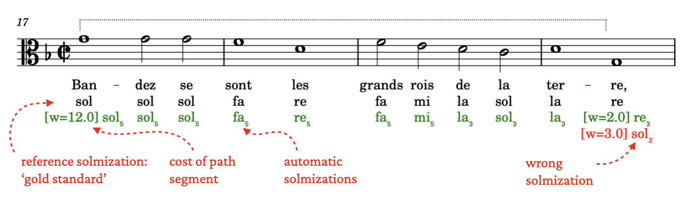

# 🌞 Delasol — automatic hexachordal solmization

**The Delasol project aims to develop methods for automatic hexachordal solmization. Currenty it supports sixteenth-century continental and English solmization styles.**

_Note: The project is still under development._

## Background

Solmization is modeled as a walk through a so-called _gamut graph_. A gamut graph describes possible melodic movements through the gamut. In the sixteenth-century, 'hard' keys without flats in the key signature are solmized using only hard and natural hexachords, whereas 'soft' keys use soft and natural hexachords. These result in two different gamut graphs. The 'continental' solmization style mutates up on the _re_ of the next hexachord, and down on _la_ of the next hexachord. This is different from the solmization style used in England around the same time. Such stylistic differences are represented by different gamut graphs. 

To produce a solmization for a given melody in a given style,  _Delasol_ looks for the cheapest path through the gamut graph that traverses the melodies' pitches. Instead of comparing all paths globally, the melody is divided into _segments_ of which the start and endpoint have only one possible solmization. The (global) cheapest path is then found by combining the best (local) paths of all segments.

Evaluating the model can be done by comparing it to reference solmizations. 
To that end we have transcribed solmizations from several sixteenth-century psalters, such as the Geneva Psalter (1562) for continental style, and the Whole Book of Psalms (1590) for English style.


## Usage

The project is in development, and has not yet been released as a python package.

```python
from music21 import converter
from delasol import solmize
score = converter.parse('my_file.musicxml')

# Find solmizations and annotate the score
solmization = solmize(score, style="continental")
solmization.annotate(target_lyrics=2)

# Show the annotated score
score.show()

# Draw the gamut and parse graph
solmiation.gamut.draw()
solmization.parse.draw()
```

Delasol can directly annotate the solmizations as lyrics to a musical score, resulting in an output like the following:



Here is an example of how you can solmize multiple voices in a musicxml file:

```python
# Load the musicxml file
score = converter.parse('my-file.mxl')

for part in score.parts:
    solmization = solmize(part, style='continental')
    solmization.annotate(
        # All these are optional:
        # Only annotate the best solmization
        best_only=True,
        # Hide the weights
        show_weights=False, 
        # Only syllables, no hexachord subscripts
        output_style='syllable', 
        # Gray out the lyrics on line 1
        grey_lyrics_num=1
    )

# Write to pdf
score.write('musicxml.pdf', 'my-solmized-file.pdf')
```

## Refence

Cornelissen, Bas, Tim Braithwaite, J. Ashley Burgoyne, and Andreas Haug. “The Helping Hand: A Computational Perspective on Guidonian Solmisation.” In Medieval and Renaissance Music Conference, Granada, 2024.
